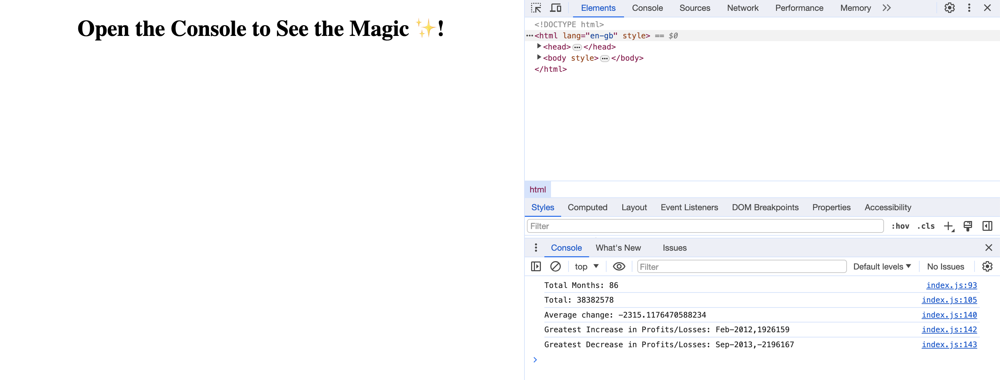

# Console-Finances

## Description
-  This project is about financial analysis using javascript
-  The analysis is done for the 7 years profit and loss data
-  Following are the details of the analysis
   - The application analysis the total number of months included in the dataset.
   - The net total amount of Profit/Losses over the entire period.
   - The average of the changes in Profit/Losses over the entire period.
   - Greatest increase and decrease in change of profit/loss along with the month/year
-  The link to my deployed application is here
  https://anumrasheed.github.io/Console-Finances/

## Usage
-  The data is visible in console of the browser with each label showing respective values
-  Below is the screenshot of the application
-  

## License

 Please refer to the LICENSE in the repo.

